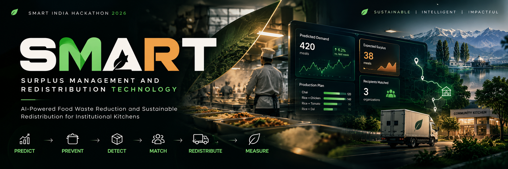

<p align="center">
  
</p>

<h1 align="center">🧠 SMART</h1>

<p align="center">
  <strong>Surplus Management and Redistribution Technology</strong>
</p>

# 🧠 SMART

## Surplus Management and Redistribution Technology

> **AI-Powered Smart Food Waste Reduction and Sustainable Redistribution Ecosystem for Institutional Kitchens and Food Processing Units**

SMART is an intelligent food surplus management system designed to help institutional kitchens make better production decisions, reduce avoidable food waste, manage surplus inventory, and connect available surplus with suitable recipient organizations.

### Core Workflow

**Predict → Prevent → Detect → Match → Redistribute → Measure**

---

## 🌍 The Problem

Institutional kitchens often prepare food based on estimated demand rather than actual expected consumption.

When demand is lower than production:

```text
Overproduction
      ↓
Unused Food
      ↓
Surplus
      ↓
Spoilage / Waste
      ↓
Economic + Environmental Loss
````

At the same time, organizations such as community kitchens, food banks, shelters, and other recipient groups may have unmet food requirements.

The challenge is therefore not only redistributing food after it becomes surplus, but also reducing unnecessary production before surplus occurs.

---

# 💡 Our Solution

SMART combines:

* Machine Learning
* Demand Forecasting
* Production Planning
* Raw Ingredient Inventory
* Surplus Inventory
* Recipient Matching
* Redistribution
* Impact Analytics

into one operational system for kitchen administrators.

Instead of treating food waste only as an end-of-day problem, SMART attempts to intervene throughout the food production cycle.

```text
             ┌──────────────────┐
             │  Demand Forecast │
             └────────┬─────────┘
                      ↓
             ┌──────────────────┐
             │ Production Plan  │
             └────────┬─────────┘
                      ↓
             ┌──────────────────┐
             │  Food Production │
             └────────┬─────────┘
                      ↓
             ┌──────────────────┐
             │ Surplus Detection│
             └────────┬─────────┘
                      ↓
             ┌──────────────────┐
             │ Surplus Inventory│
             └────────┬─────────┘
                      ↓
             ┌──────────────────┐
             │ Recipient Match  │
             └────────┬─────────┘
                      ↓
             ┌──────────────────┐
             │ Redistribution   │
             └────────┬─────────┘
                      ↓
             ┌──────────────────┐
             │ Impact Analytics │
             └──────────────────┘
```

---

# 🚀 Key Features

## 🤖 AI Demand Prediction

SMART uses a machine-learning model to estimate expected daily food demand using operational and contextual factors such as:

* Day of the week
* Holiday status
* Special events
* Weather conditions
* Precipitation

The predicted demand becomes the foundation for production planning.

---

## 🍚 Item-Level Production Planning

SMART predicts overall daily demand and distributes the requirement across selected menu items using historical consumption patterns.

Current menu items:

* Chai
* Rice with Chicken
* Rice with Tomato
* Rice with Dal

The system maintains reconciliation between the overall prediction and item-level production quantities.

---

## 📦 Surplus Inventory

Positive surplus generated at the end of production can be added to the surplus inventory.

Each surplus batch contains:

* Inventory ID
* Date added
* Menu item
* Original quantity
* Remaining quantity
* Expiry date
* Status

Surplus is treated as managed inventory rather than automatically being classified as waste.

---

## ⏳ Shelf-Life Management

SMART allows administrators to configure the shelf life of prepared food for each menu item.

For example:

```text
Chai
Shelf Life = 7 days

Added: 26 September
Expiry: 3 October
```

The system automatically calculates expiry dates for surplus batches.

---

# 🥘 Raw Ingredient Inventory

SMART also manages ingredients before food production takes place.

### Current Raw Ingredients

* Tea Leaves
* Sugar
* Milk
* Rice
* Dal
* Tomato
* Chicken

Raw inventory is maintained at batch level with:

* Quantity
* Unit
* Date added
* Expiry
* Status
* Batch identification

---

# 🧾 Recipe / BOM Based Capacity

SMART contains a lightweight Bill of Materials (BOM) for the menu items.

### Chai

```text
Tea Leaves
Sugar
Milk
```

### Rice with Chicken

```text
Rice
Chicken
```

### Rice with Tomato

```text
Rice
Tomato
```

### Rice with Dal

```text
Rice
Dal
```

Using the available raw ingredients, SMART estimates how many servings of each menu item can currently be produced.

This helps identify ingredient bottlenecks before production.

---

# 🔄 FEFO Inventory Handling

Raw ingredients are managed using a **First-Expire, First-Out (FEFO)** approach.

When ingredients are consumed during production, the system prioritizes eligible batches according to expiry.

This helps reduce the possibility of older usable ingredients remaining unused while approaching expiry.

---

# 📝 End-of-Day Operations

After production, the kitchen administrator records:

* Actual production
* Actual consumption

The system calculates:

```text
Surplus = Actual Production − Actual Consumption
```

Only positive surplus is introduced into surplus inventory.

The system also prevents duplicate processing of the same production record.

---

# 🤝 Recipient Matching

When surplus is available, SMART helps the kitchen administrator identify suitable recipients.

Recipients can include:

* Community Kitchens
* Food Banks
* Shelters
* Learning / Community Centres

The system supports multiple allocation strategies.

### Even Distribution

Distributes available surplus across suitable recipients.

### Manual Allocation

Allows the administrator to directly decide quantities.

### Item-wise Allocation

Allows different quantities of individual menu items to be assigned to different recipients.

---

# 🗺️ Recipient Mapping

The Recipient Matching interface provides a geographical view of the kitchen and recipient locations.

Recipient records contain latitude and longitude information, allowing the system to visualize relationships between the kitchen and potential recipients.

The mapping component is designed to support operational dispatch and future road-network routing.

---

# 📊 Impact Analytics

SMART provides an overview of the operational impact generated by the system.

Analytics include:

* Surplus generated
* Surplus redistributed
* Remaining surplus
* Item-level surplus
* Item-level redistribution
* Redistribution activity over time
* Raw ingredient usage

The objective is to provide the kitchen administrator with a measurable view of food-surplus management.

---

# 🔔 Notification Center

SMART provides a centralized notification area for important operational warnings.

Notifications can include:

* Low raw-ingredient stock
* Unmapped ingredients
* Expiring raw ingredients
* Expired inventory
* Prediction feasibility issues

This keeps important warnings visible without overwhelming the main dashboard.

---

# ⚙️ Configurable Settings

SMART provides configurable operational settings.

### Production Planning

* Baseline preparation window
* Safety buffer

### Inventory & Expiry

* Expiring-soon threshold
* Approaching-expiry threshold

### Notifications

* Stock warnings
* Expiry warnings
* Prediction feasibility warnings

### Prepared Food

* Shelf life for each menu item

---

# 🧠 Machine Learning Pipeline

The demand prediction system uses historical daily operational data.

### Input Features

```text
Day of Week
Holiday
Special Event
Weather
Precipitation
```

### Prediction Target

```text
Actual Consumption
```

The prediction is then used by the production-planning workflow.

---

# 🏗️ System Architecture

```text
                    SMART SYSTEM
                         │
          ┌──────────────┼──────────────┐
          │              │              │
          ▼              ▼              ▼
    Historical Data   Raw Inventory   Operations
          │              │              │
          ▼              ▼              ▼
     ML Prediction     BOM / FEFO     EOD Data
          │              │              │
          └──────────────┼──────────────┘
                         ▼
                Production Planning
                         │
                         ▼
                  Surplus Detection
                         │
                         ▼
                 Surplus Inventory
                         │
                         ▼
                 Recipient Matching
                         │
                         ▼
                  Redistribution
                         │
                         ▼
                  Impact Analytics
```

---

# 🛠️ Technology Stack

| Technology                   | Purpose                      |
| ---------------------------- | ---------------------------- |
| Python                       | Core application logic       |
| Streamlit                    | Interactive web application  |
| Pandas                       | Data processing              |
| Scikit-learn                 | Machine Learning             |
| Joblib                       | Model persistence            |
| PyDeck                       | Geographic visualization     |
| OpenStreetMap-based services | Geographic / routing support |
| CSV                          | Operational datasets         |
| JSON                         | Configuration                |

---

# 📁 Project Structure

```text
AI-Food-Surplus-Management-And-Redistribution-System/
│
├── dashboard.py
│
├── data/
│   ├── daily_history.csv
│   ├── daily_operations.csv
│   ├── inventory.csv
│   ├── item_history.csv
│   ├── kitchen_history.csv
│   ├── kitchen_settings.json
│   ├── raw_inventory.csv
│   ├── redistribution_records.csv
│   └── surplus_shelf_life.csv
│
├── scripts/
│   └── migrate_menu_data.py
│
├── src/
│   ├── data_preprocessing.py
│   ├── demand_prediction.py
│   ├── daily_demand_model.py
│   ├── inventory.py
│   ├── kitchen_config.py
│   ├── maps.py
│   └── raw_inventory.py
│
├── requirements.txt
├── README.md
└── .gitignore
```

---

# 💻 Installation

## 1. Clone the Repository

```bash
git clone https://github.com/Mohamin007/AI-Food-Surplus-Management-And-Redistribution-System.git
```

```bash
cd AI-Food-Surplus-Management-And-Redistribution-System
```

---

## 2. Create a Virtual Environment

### Windows

```bash
python -m venv .venv
```

Activate:

```bash
.venv\Scripts\activate
```

### Linux / macOS

```bash
python3 -m venv .venv
```

Activate:

```bash
source .venv/bin/activate
```

---

## 3. Install Dependencies

```bash
pip install -r requirements.txt
```

---

## 4. Run SMART

```bash
streamlit run dashboard.py
```

The application will open in your browser.

---

# 📌 Prototype Scope

SMART is currently developed as a **prototype for the Smart India Hackathon 2026 problem statement**.

The system demonstrates the operational concept from demand prediction through surplus management and redistribution.

Some datasets, recipes, environmental-impact factors, safety buffers, shelf-life values, and operational thresholds are prototype assumptions and should be replaced with validated institutional data before real-world deployment.

---

# 🔮 Future Scope

Potential future improvements include:

* Larger real-world training datasets
* Continuous model retraining
* Improved demand forecasting
* Multi-kitchen deployment
* Advanced route optimization
* Real-time recipient availability
* Automated dispatch planning
* Mobile support
* Authentication and role-based access
* Integration with institutional kitchen systems
* Real-time monitoring
* Advanced impact measurement
* Integration with institutional food-management systems

---

# 🎯 Project Vision

SMART aims to shift food-waste management from a **reactive process** to a **predictive and preventive system**.

Instead of asking:

> **"What do we do with the food we already wasted?"**

SMART aims to help kitchens ask:

> **"How much food do we actually need, how much should we prepare, and what should we do with the surplus that remains?"**

---

# 🏆 Smart India Hackathon 2026

**Problem Statement:**
AI-Powered Smart Food Waste Reduction and Sustainable Redistribution Ecosystem for Institutional Kitchens and Food Processing Units

**Problem Statement ID:** `26234`

**Organization:** Ministry of Food Processing Industries (MoFPI)

**Category:** Software

**Theme:** Agriculture, FoodTech & Rural Development

---

# 👨‍💻 Developed By

## 🌈 **M O H A M I N   M I R**

### **Mohamin Mir**

**Data Science & AI**
**University of Kashmir**

---

<div align="center">

## 🧠 SMART

### Surplus Management and Redistribution Technology

**Predict • Prevent • Detect • Match • Redistribute • Measure**

</div>
```
